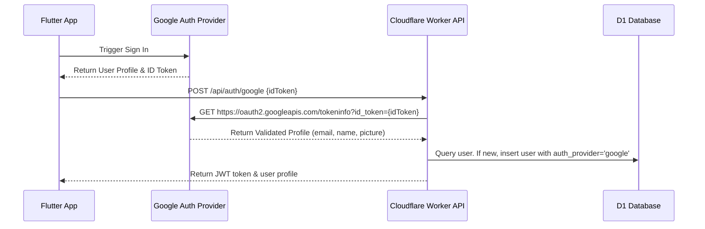

# Google Sign-In Integration: Prerequisites & Key Checklist

To enable "Login by Google" in the Zanny Collection application, we need to set up Google OAuth 2.0 Credentials on Firebase and Google Cloud Console. Follow this checklist to prepare the keys needed for development.

---

## 1. Firebase / Google Cloud Console Project

Google Sign-In uses Firebase Auth or standard Google OAuth 2.0:
1. Go to the [Firebase Console](https://console.firebase.google.com/) and create or open your project (**zanny-collection**).
2. Go to **Authentication > Sign-in method**, enable **Google**, and save.
3. Note your **Web SDK Configuration Client ID** (this is the Client ID we will configure in both the Flutter app and Cloudflare Worker).

---

## 2. Platform-Specific Setup (Android & iOS)

### Android Configuration:
1. Generate your keystore SHA-1 fingerprint. Run this command in your terminal:
   ```bash
   keytool -list -v -keystore ~/.android/debug.keystore -alias androiddebugkey -storepass android -keypass android
   ```
2. Add your **SHA-1 fingerprint** to your Firebase Project Settings under **Android Apps**.
3. Download the updated `google-services.json` file and place it in your Flutter app's `android/app/` directory.

### iOS Configuration:
1. Register your iOS Bundle ID (`com.zanny.collection` or similar) in the Firebase console.
2. Download `GoogleService-Info.plist` and add it to your Xcode project.
3. Add the `REVERSED_CLIENT_ID` as a URL scheme in Xcode Info settings.

---

## 3. Worker Configuration (Backend Verification)

The Flutter app will obtain an **ID Token** from Google and pass it to the Cloudflare Worker API. The Worker must securely verify this token using Google's token verification endpoints.

To prepare the Worker, we need to set the Google Client ID as a secret:
```bash
npx wrangler secret put GOOGLE_CLIENT_ID
```

---

## 4. Proposed API Flow


