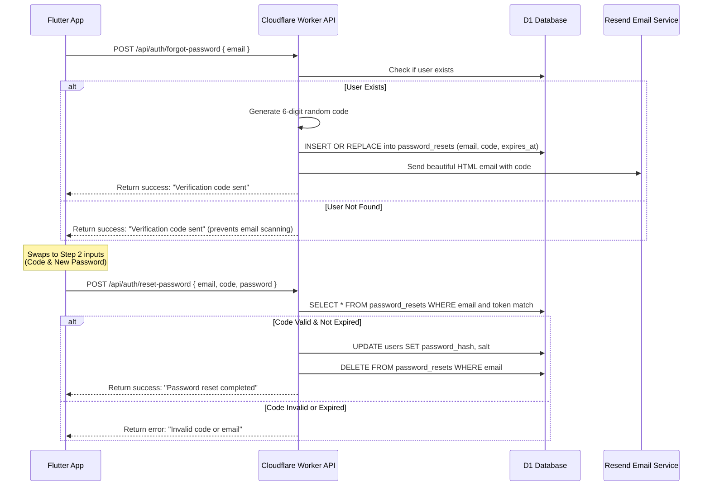

# Zanny Collection — Password Verification Code Guide

This document describes how the password reset and 6-digit verification code system works on both the backend (Cloudflare Worker + D1 Database + Resend) and frontend (Flutter application).

---

## 🏗️ Workflow Overview

Instead of photographic or raw UUID reset links, Zanny Collection uses a secure 6-digit numeric code delivered directly to the user's registered email address.



---

## 💾 Database Schema (`password_resets`)

The codes are tracked in a dedicated D1 table defined in [schema.sql](file:///c:/Users/Administrator/Desktop/zanny%20collection%20application/cloudflare-worker/schema.sql):

```sql
CREATE TABLE IF NOT EXISTS password_resets (
  email      TEXT PRIMARY KEY,
  token      TEXT NOT NULL,          -- Stores the 6-digit verification code
  expires_at TEXT NOT NULL,          -- ISO timestamp of code expiry (15 mins duration)
  created_at TEXT DEFAULT (datetime('now'))
);

CREATE INDEX IF NOT EXISTS idx_password_resets_token ON password_resets(token);
```

---

## 🔌 API Endpoints

Both endpoints are registered in [index.js](file:///c:/Users/Administrator/Desktop/zanny%20collection%20application/cloudflare-worker/src/index.js):

### 1. Request Code
* **Route**: `POST /api/auth/forgot-password`
* **Payload**:
  ```json
  {
    "email": "user@example.com"
  }
  ```
* **Behavior**:
  - Generates a random 6-digit numeric string: `Math.floor(100000 + Math.random() * 900000).toString()`.
  - Sets expiration time to exactly **15 minutes** in the future.
  - Sends a premium dark-themed HTML verification email via the Resend client.

### 2. Confirm Reset
* **Route**: `POST /api/auth/reset-password`
* **Payload**:
  ```json
  {
    "email": "user@example.com",
    "code": "123456",
    "password": "newpassword123"
  }
  ```
* **Behavior**:
  - Verifies the combination of email and code in the database.
  - Rejects if the current time exceeds `expires_at`.
  - Hashes the new password, updates the `users` table, and cleans up the code from the `password_resets` table.

---

## 📱 Flutter Mobile Implementation

### 1. State Management
The API logic is encapsulated in `AuthNotifier` within [auth_provider.dart](file:///c:/Users/Administrator/Desktop/zanny%20collection%20application/lib/shared/providers/auth_provider.dart):
* `resetPassword(String email)`: Calls `/api/auth/forgot-password` to trigger code generation.
* `confirmResetPassword({email, code, newPassword})`: Calls `/api/auth/reset-password` to submit changes.

### 2. Redesigned User Interface
Located in the `_showForgotPassword` bottom sheet inside [login_screen.dart](file:///c:/Users/Administrator/Desktop/zanny%20collection%20application/lib/features/auth/screens/login_screen.dart):
* **Step 1**: The user enters their email and taps **SEND CODE**.
* **Step 2**: The UI changes dynamically using `StatefulBuilder` to hide the email input and display two new fields:
  - **6-digit Code** (numeric input, length capped to 6)
  - **New Password** (obscured secure text input)
* User is shown clean success feedbacks using `ZannyFeedback` upon completing the flow successfully.
