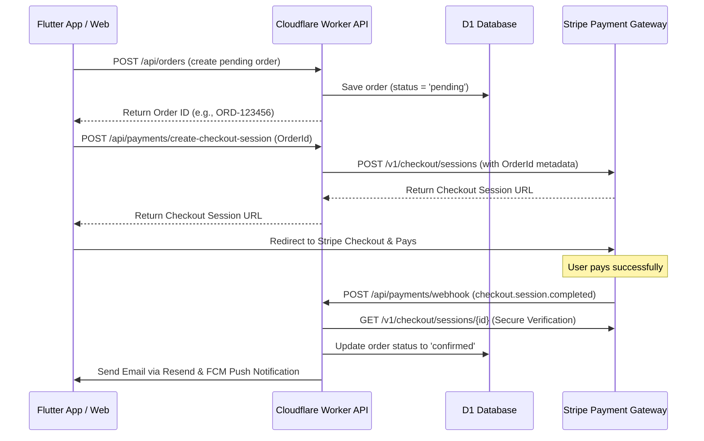

# Stripe Integration: Security, Architecture & Key Configuration

This document outlines the architecture, security safeguards, double-payment prevention, and configuration steps for the Stripe payment integration.

---

## 1. Security & PCI Compliance ("Zero-Footprint Firewall")

By using **Stripe Hosted Checkout**, we achieve maximum security and standard PCI compliance:
- **No Card Handling**: The customer enters their card, CVV, or mobile wallet details directly on Stripe's PCI-DSS Level 1 certified checkout domain (`checkout.stripe.com`).
- **No Local Storage**: Card numbers, PINs, or card passwords **never** touch our Cloudflare Worker or D1 Database. 
- **Ephemeral Session Tokens**: The only payment data stored locally is the Stripe Checkout Session ID and Stripe transaction/receipt IDs for order matching.

---

## 2. Dynamic Architecture & Webhook Flow

Below is the workflow showing the transaction cycle:



---

## 3. Double-Payment Prevention (Network Failure Mitigation)

To prevent users from being charged twice or prompted to pay twice under poor network conditions (e.g., app crash, connection loss after payment):

1. **Idempotent Order Check**: Before creating a Stripe checkout session, the API queries D1. If the order status is already `confirmed` (paid), it rejects the payment session request.
2. **Checkout Session Cache**:
   - We will add a `stripe_session_id` column to the `orders` table.
   - If a session is requested for a pending order that already has an associated `stripe_session_id`, we fetch the existing session from Stripe instead of creating a new one.
3. **Asynchronous Webhook Completion (Self-Healing)**:
   - If the user's connection drops after paying, the Stripe Webhook runs in the background. It will mark the order as `confirmed` inside D1 regardless of whether the user redirects back to the app.
   - Once they reopen the app, a poll requests their updated order status, showing the order as successfully paid.

---

## 4. Required Stripe API Keys & Setup

To activate the integration, you need to configure three keys in your environment:

| Key Name | Description | Source | Setup Method |
| :--- | :--- | :--- | :--- |
| **`STRIPE_PUBLISHABLE_KEY`** | Public key used in the Flutter app to identify your Stripe account. | Stripe Dashboard (Developers > API Keys) | Add to App `.env` config |
| **`STRIPE_SECRET_KEY`** | Secret key used by the Worker to interact securely with Stripe APIs. | Stripe Dashboard (Developers > API Keys) | Cloudflare Secret (see below) |
| **`STRIPE_WEBHOOK_SECRET`** | Secret key used to verify the authenticity of incoming Webhook payloads. | Stripe Dashboard (Developers > Webhooks) | Cloudflare Secret (see below) |

### How to Configure Secrets in Cloudflare Workers:
Run the following commands in your terminal to set your live secrets in Cloudflare (this encrypts them so they are not exposed in code repositories):

```bash
# Set your Stripe Secret Key
npx wrangler secret put STRIPE_SECRET_KEY

# Set your Stripe Webhook Signing Secret
npx wrangler secret put STRIPE_WEBHOOK_SECRET
```

### Webhook URL Configuration:
In your Stripe Dashboard under **Developers > Webhooks**, add a new endpoint pointing to your live worker API:
- **Webhook URL**: `https://zanny-collection-api.zannykenya254.workers.dev/api/payments/webhook`
- **Events to Listen**: `checkout.session.completed`
