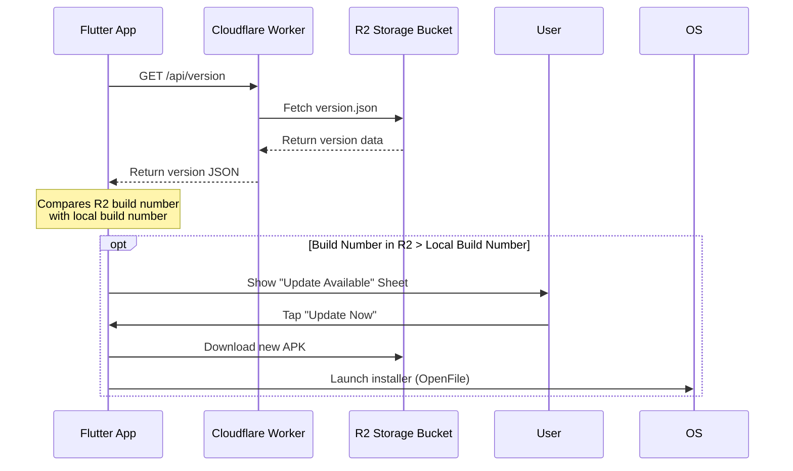

# Zanny Collection — App Update System Documentation

This document describes how the in-app update mechanism functions for the Zanny Collection Flutter application using the Cloudflare Worker API and Cloudflare R2 storage.

---

## 🏗️ Architecture Overview

The system consists of three main components:
1. **Flutter App**: Regularly checks for updates, displays the update prompt to users, downloads the new APK, and triggers the Android system installer.
2. **Cloudflare Worker (`zanny-collection-api`)**: Serves as the middleman API, providing the endpoint `/api/version` to get or update the app's current version information.
3. **Cloudflare R2 Bucket (`zanny-images`)**: Stores the actual release APK files and a `version.json` file containing the latest release metadata.



---

## 📄 The Version Metadata File (`version.json`)

The update status is driven by a `version.json` file stored in the root of the R2 bucket. It has the following JSON structure:

```json
{
  "version": "1.0.2",
  "build": 2,
  "apk_url": "https://pub-0a4117480fe8436ca1a1255ce208d231.r2.dev/zanny_collection_v1.0.2_20260612_2019.apk",
  "changelog": "New R2 image upload endpoint and database optimizations."
}
```

* `version`: A human-readable version string matching the `version` field in `pubspec.yaml` (e.g. `1.0.2`).
* `build`: An integer build number matching the `+X` portion of the `version` field in `pubspec.yaml` (e.g. `2`). **The app uses this number to decide if an update is available.**
* `apk_url`: The public direct download URL of the APK file hosted on R2.
* `changelog`: Short bullet points explaining the new changes that will show up inside the update bottom sheet.

---

## 🛠️ Step-by-Step Release Workflow

When you want to publish a new update for the application, follow these steps:

### Step 1: Increment the Version
Open [pubspec.yaml](file:///c:/Users/Administrator/Desktop/zanny%20collection%20application/pubspec.yaml) and increment both the version string and build number.
* For example, change `version: 1.0.6+18` to `version: 1.0.7+19`.

### Step 2: Build the APK
Run the Flutter build command using compile-time definitions for your endpoints:
```powershell
C:\flutter\bin\flutter.bat build apk --release --obfuscate --split-debug-info=build/app/outputs/symbols --dart-define=CF_WORKER_URL=https://zanny-collection-api.zannykenya254.workers.dev --dart-define=CF_R2_PUBLIC_URL=https://pub-0a4117480fe8436ca1a1255ce208d231.r2.dev
```

### Step 3: Rename the APK
Run the automated rename script to assign the correct version tag and timestamp:
```powershell
C:\flutter\bin\dart.bat run scripts/rename_apk.dart
```
This moves and renames your file to `build/app/outputs/flutter-apk/zanny_collection_v1.0.3_XXXXXXXX_XXXX.apk`.

### Step 4: Upload APK to Cloudflare R2
Upload the generated `.apk` file to your `zanny-images` R2 bucket. You can do this:
* Via the Cloudflare Web Dashboard.
* Via Wrangler CLI:
  ```bash
  npx wrangler r2 object put zanny-images/zanny_collection_v1.0.3_XXXXXXXX_XXXX.apk --file=build/app/outputs/flutter-apk/zanny_collection_v1.0.3_XXXXXXXX_XXXX.apk
  ```

### Step 5: Update the `version.json` File
Notify the API of the new release version. Send a authenticated `PUT` request to `/api/version` containing the JSON metadata, or upload `version.json` directly to the R2 bucket.

Once `version.json` contains a `build` number higher than the user's current build, the next time their app launches or runs an update check, they will be prompted to download and install the new update automatically. This should only happen when we are sure that cloudfare has everything to avoid the loop of user downloading files that have not been fully pushed to cloudfare.
