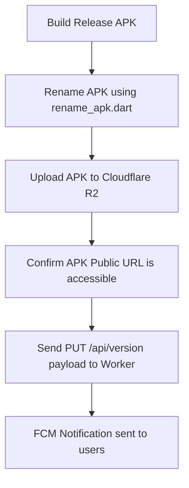

# Zanny Collection — App Development & Safe Release Guidelines

This document outlines the standard procedure for implementing new features, validating code quality, compiling release builds, and safely deploying updates. Following these guidelines ensures that app updates are smooth, signatures are aligned, and users do not encounter infinite update loops or failed downloads.

---

## 🏗️ 1. Feature Development & Quality Assurance

Before making any release, ensure the codebase is stable and bug-free:

### Step 1.1: Local Feature Testing
- Test the new feature on an emulator or a physical device in both **Light Mode** and **Dark Mode**.
- Verify that standard UI components (like rating summaries, visual trackers, and buttons) react dynamically to theme switches.
- Perform sanity checks on core transactional operations:
  - Add items to the cart, verify checkout details, payment options, and order placement.
  - Verify that stock decrement, sold count increment, and COD restrictions function as expected on checkout.

### Step 1.2: Code Analysis and Error Elimination
- Run the Flutter analyzer to check for warnings, deprecations, or syntax issues:
  ```bash
  flutter analyze
  ```
- **Constraint**: The project must have **0 analyzer errors** before compilation. Resolve all warnings and lints.

---

## 🏷️ 2. Version Synchronization

To trigger the in-app update prompt, the app's version and build number must be aligned locally and on the server.

### Step 2.1: Increment `pubspec.yaml`
Open [pubspec.yaml](file:///c:/Users/Administrator/Desktop/zanny%20collection%20application/pubspec.yaml) and increment the version name and build number (e.g. from `1.0.19+38` to `1.0.20+39`):
```yaml
version: 1.0.20+39
```

### Step 2.2: Align `update_service.dart`
Open [update_service.dart](file:///c:/Users/Administrator/Desktop/zanny%20collection%20application/lib/core/services/update_service.dart) and update the local constants to match `pubspec.yaml` exactly:
```dart
static const String currentVersion = '1.0.20';
static const int currentBuild = 39;
```

---

## 📦 3. Compiling the Release APK

Compile the release build passing the production endpoints as compile-time definitions. This ensures the app communicates with the correct production database and CDN.

Run the build command from the project root:
```powershell
flutter build apk --release --obfuscate --split-debug-info=build/app/outputs/symbols --dart-define=CF_WORKER_URL=https://zanny-collection-api.zannykenya254.workers.dev --dart-define=CF_R2_PUBLIC_URL=https://pub-0a4117480fe8436ca1a1255ce208d231.r2.dev
```

*Note: The keystore configuration in [build.gradle.kts](file:///c:/Users/Administrator/Desktop/zanny%20collection%20application/android/app/build.gradle.kts) automatically signs the APK using the shared `key.jks` so that the update will successfully install over existing builds.*

---

## 🚀 4. Safe Deployment Sequence (The Golden Rules)

To prevent users from getting update notifications before the update files are ready, follow this exact sequence:



### Step 4.1: Rename the APK
Run the renaming script to append the version and timestamp:
```powershell
dart run scripts/rename_apk.dart
```
This renames `app-release.apk` to `zanny_collection_v1.0.20_YYYYMMDD_HHMM.apk` in the build output directory.

### Step 4.2: Upload the APK to Cloudflare R2 (First!)
Upload the APK directly to the R2 bucket. This step is time-consuming and must finish **before** the API is updated:
```powershell
npx wrangler r2 object put zanny-images/zanny_collection_v1.0.20_YYYYMMDD_HHMM.apk --file=build/app/outputs/flutter-apk/zanny_collection_v1.0.20_YYYYMMDD_HHMM.apk --remote
```

### Step 4.3: Verify APK Accessibility
Before triggering the update API, copy the direct public URL of the uploaded APK and verify it is downloadable:
`https://pub-0a4117480fe8436ca1a1255ce208d231.r2.dev/zanny_collection_v1.0.20_YYYYMMDD_HHMM.apk`

> [!WARNING]
> Do NOT use the Worker endpoint proxy to serve the APK because Workers have a strict 100MB body size limit, which will crash downloads. Use the direct R2 CDN URL.

### Step 4.4: Trigger Update & FCM Notifications (Last!)
Once the APK is verified to be live and downloadable, run the deployment script or send a `PUT` request to `/api/version` to publish `version.json` and trigger FCM:
```powershell
node scripts/publish_r2.js
```
The Worker will:
1. Receive the payload and save `version.json` in the R2 bucket.
2. Send a Firebase FCM broadcast notification to all registered phones.

---

## 🔍 5. Post-Deployment Verification

After the release is complete:
1. Open the Zanny Collection app on a test device running a lower build (e.g. Build 38).
2. Wait for the custom animated bottom sheet to appear.
3. Tap **Update Now** and verify that:
   - The download progress indicator runs smoothly.
   - The Android package installer launches successfully.
   - The app installs in-place.
   - On reopen, the app starts normally and does **not** show the update bottom sheet again (confirming cache-busting and version alignment work perfectly).
