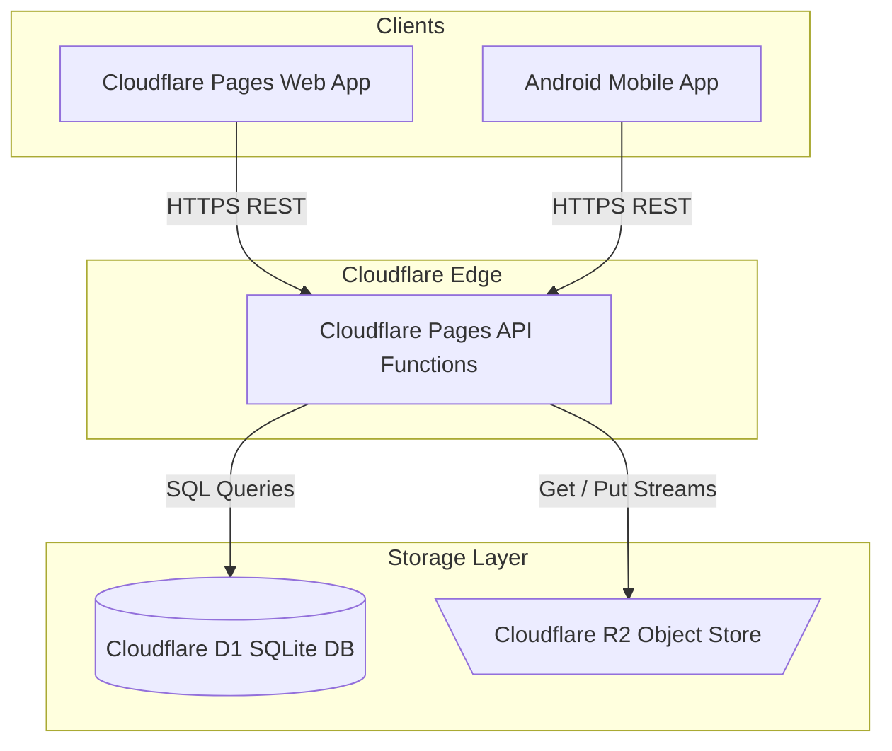
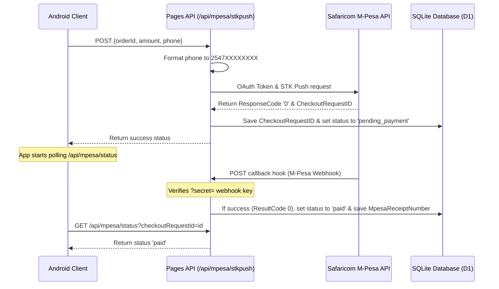

# Zanny Collection Mobile Integration & Backend Guide

This integration guide provides a developer layup detailing the database schemas, storage conventions, and API communication flows of the Zanny Collection platform. Since both the website and the Android application must share the same database (`zanny-db` on Cloudflare D1) and image store (Cloudflare R2), this document outlines the exact technical standards the mobile application must adhere to for synchronization.

---

## 🏗️ System & Communication Architecture

The Zanny Collection platform utilizes a modern serverless structure. The database and object storage are secured behind Cloudflare's edge network, meaning **mobile and web clients do not communicate with the database or storage buckets directly.**



- **Cloudflare D1**: SQLite-based relational database that stores users, products, orders, cart items, wishlists, and sessions.
- **Cloudflare R2**: S3-compatible object store that houses raw product image and banner assets.
- **Cloudflare Pages Functions**: Serving as the secure REST API layer, all clients make HTTP requests to Pages endpoints. For example, upload requests go to `/api/upload` and return a secure public path `/api/images/products/...` which the backend fetches internally from R2.

---

## 🗄️ Database Schemas & Storage Conventions

SQLite lacks native boolean or complex array types. The following conventions are used to store data in Cloudflare D1:
1. **Booleans**: Mapped to `INTEGER` (where `1` represents `true` and `0` represents `false`).
2. **JSON Fields**: Arrays and structured lists (such as product images, colors, sizes, and variations) are serialized to strings (`JSON.stringify()`) before inserting and parsed (`JSON.parse()`) upon retrieval.

### Core Database Tables

#### 1. `users`
Manages user accounts, login history, push notifications, and payment access privileges.
- **`id`** (`TEXT PRIMARY KEY`): A unique UUID generated on signup.
- **`email`** (`TEXT UNIQUE NOT NULL`): Normalized lowercase email.
- **`password_hash`** / **`salt`** (`TEXT`): Created using PBKDF2-HMAC-SHA256 with 100,000 iterations and a 16-byte random salt.
- **`is_admin`** (`INTEGER`): `1` for admin, `0` for customers.
- **`is_verified`** (`INTEGER`): `1` if email has been verified via the OTP code.
- **`restricted_from_cod`** (`INTEGER`): `1` if banned from using Cash on Delivery (anti-fraud).
- **`consecutive_cancellations`** (`INTEGER`): Counts consecutive order cancellations.
- **`consecutive_successful_orders`** (`INTEGER`): Tracks reliable orders to restore privileges.

#### 2. `products`
Defines the fashion catalog items, prices, and warehouse availability.
- **`id`** (`TEXT PRIMARY KEY`): Unique product ID slug (e.g., `oversized-zc-hoodie`).
- **`images`** (`TEXT`): JSON Array string representing image files.
- **`gallery_urls`** (`TEXT`): JSON Array string containing sub-images.
- **`colors`** / **`sizes`** (`TEXT`): Serialized JSON Arrays (e.g., `["Black", "Gray"]` and `["M", "L", "XL"]`).
- **`variations`** (`TEXT`): JSON string of objects mapping size-color combinations to specific stock details.
- **`stock`** (`INTEGER`): Units left in the warehouse.
- **`sold`** (`INTEGER`): Total items sold historically (used for ranking popular items).
- **`is_deleted`** (`INTEGER`): Soft-delete flag. Instead of purging rows (which breaks historic orders), the backend sets `is_deleted = 1`, `stock = 0`, and clears the `image_url`.

#### 3. `cart_items`
Synchronizes user shopping carts in real time across web and mobile.
- **`id`** (`TEXT PRIMARY KEY`): Composite key to enforce upsert safety:
  $$\text{id} = \text{user\_id} - \text{product\_id} - \text{color} - \text{size}$$
- **`user_id`** (`TEXT`): Owner's foreign key reference.
- **`product_id`** (`TEXT`): Product foreign key reference.
- **`quantity`** (`INTEGER`): Number of items in cart.
- **`color`** / **`size`** (`TEXT`): Specifications.

#### 4. `orders`
Logs checkouts, payment references, and transit statuses.
- **`id`** (`TEXT PRIMARY KEY`): Order identifier (e.g., `ORD-871928`).
- **`items`** (`TEXT NOT NULL`): **Critical historic snapshot.** A serialized JSON array of products, quantities, prices, and sizes *at the time of purchase*. This ensures product price changes or deletion does not modify old orders.
- **`status`** (`TEXT`): Current state (`'pending'`, `'pending_payment'`, `'confirmed'`, `'shipped'`, `'delivered'`, `'cancelled'`, `'payment_failed'`).
- **`mpesa_checkout_id`** (`TEXT`): Checkout request ID from Safaricom STK Push.
- **`mpesa_receipt`** (`TEXT`): Transferred receipt code (e.g., `RLN8104HS`).

#### 5. `feedback`
Captures review ratings and comments for delivered products.
- **`id`** (`TEXT PRIMARY KEY`): Review tracking code (`FB-XXXXXX`).
- **`order_id`** (`TEXT`): Delivered order reference.
- **`rating`** (`INTEGER`): Scale of 1 to 5 stars.
- **`comment`** (`TEXT`): Review comment sanitized to strip HTML tag elements.

---

## 🔄 Mobile Integration API Specifications

### 1. Authentication & Session Synchronization
The Android app must interact with the backend APIs to log users in, manage sessions, and verify emails.

- **Session Identification (`zanny_session`)**:
  - The API verifies users using session tokens saved in the `sessions` table.
  - On successful login (`POST /api/auth/login`) or verification (`POST /api/auth/verify`), the server sets a cookie header:
    ```http
    Set-Cookie: zanny_session=uuid-session-token-string; HttpOnly; Secure; Path=/; SameSite=Strict
    ```
  - **Android Implementation**: The mobile app must save this cookie token in a persistent cookie jar (e.g., using OkHttp `CookieJar`) and send it as a header in all subsequent requests:
    ```http
    Cookie: zanny_session=uuid-session-token-string
    ```

- **Password Hashing (Sign up & Verification)**:
  - If handling client-side pre-hashing, it must match standard PBKDF2:
    - **Algorithm**: PBKDF2
    - **Digest**: SHA-256
    - **Salt**: 16-byte random salt
    - **Iterations**: 100,000
    - **Key Length**: 256 bits (32 bytes)
  - The backend handles this natively on `/api/auth/register`, which generates the verification code and sends it via email.

---

### 2. Shopping Cart Sync Flow
To keep cart contents synced between the mobile app and website:
1. When the user modifies their cart offline, hold the list locally.
2. Once connected or on app launch, trigger a bulk overwrite request:
   - **Endpoint**: `POST /api/cart`
   - **Payload**:
     ```json
     {
       "items": [
         { "id": "product-uuid", "qty": 2, "color": "Black", "size": "XL" }
       ]
     }
     ```
   - **Server Logic**: The server clears old records for that user ID and batch-inserts the new list using the composite cart primary key structure.

---

### 3. Secure Checkout & Anti-Fraud Trust System
- **Stock Validation**: Creating an order (`POST /api/orders`) triggers a backend loop verifying live stock levels. If stock is sufficient, the order is created, the stock is decremented, and the product `sold` count is incremented.
- **Anti-Fraud System (COD Restricting)**:
  - If a user cancels Cash on Delivery (COD) orders three times consecutively, their account profile updates to `restricted_from_cod = 1`.
  - The API checks this flag during checkout (`POST /api/orders`). If restricted, the server rejects COD payloads, returning:
    ```json
    { "error": "Pay on Delivery is temporarily disabled for your account. Please pay upfront via M-Pesa." }
    ```
  - **Restoring Access**: The user must complete three consecutive successful prepaid orders to reset `restricted_from_cod` back to `0`.

---

### 4. M-Pesa Checkout Flow
To accept Kenyan mobile payments (M-Pesa Express STK Push):



- **M-Pesa Status Polling**: The mobile app should poll the payment status endpoint (`GET /api/mpesa/status?checkoutRequestId=<id>`) every 2-3 seconds until a state change (`paid` or `payment_failed`) occurs.

---

### 5. Media Upload to R2 Bucket
When adding or updating catalog items (Admin role only):
- **Endpoint**: `POST /api/upload`
- **Method**: Multipart Form Data with the key name `file`.
- **Backend Flow**:
  1. The API validates if the session belongs to an admin (`requireAdmin()`).
  2. Generates a unique file name using `crypto.randomUUID()`.
  3. Puts the stream into the Cloudflare R2 bucket:
     ```javascript
     context.env.BUCKET.put(key, file.stream(), { httpMetadata: { contentType: file.type } })
     ```
  4. Returns the secure routing URL: `/api/images/products/<uuid>.<ext>`.

---

## 🛡️ Admin Section Layout & Obfuscation

The admin dashboard endpoints (`/api/admin/*`) are protected using strict authorization guards.

1. **Obfuscation Rule**: If a non-admin client attempts to fetch admin-related views or access routes, the server does not return `403 Forbidden` (which reveals the endpoint exists). Instead, it returns a **404 Not Found** status code.
2. **Step-Up Authentication**:
   - Gaining access to write or delete operations on products, or managing blacklists, requires a second-factor password challenge.
   - The user must post their master password to `/api/auth/verify-password`.
   - The server introduces a uniform `500ms` delay on mismatch verification requests to mitigate timing and brute-force attacks.
3. **IP Blacklist Security**:
   - The admin dashboard communicates with `blacklisted_ips` to dynamically block malicious callers.
   - Standard IP blocks are loaded automatically by middleware.
